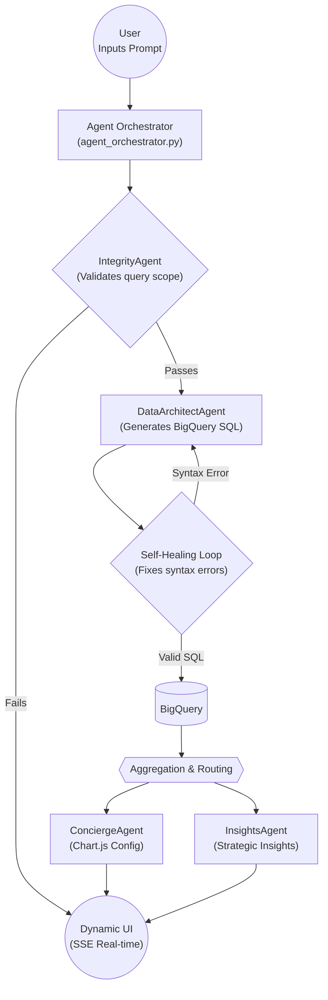

# Full-Funnel Ads Strategic Concierge
### A Deterministic, Multi-Agent System for Enterprise Analytics

## Problem Statement

### The Bottleneck: Data Wrangling vs. Value Creation
In a traditional FP&A or marketing analytics workflow, a senior analyst spends hours (sometimes days) manually writing SQL, extracting data from BigQuery, exporting to Excel, cleaning null values, and building visualizations. This tedious non-value adding part of the workflow, prevents analysts from doing actual value-adding work like refining insights, identifying growth drivers, or solving complex business problems.

### The Root Cause:
While "Chat-to-Data" tools attempt to solve this manual bottleneck, traditional LLM-to-SQL implementations fail in real-world enterprise environments due to three critical areas. To solve this universal problem, we built a deterministic multi-agent architecture and stress-tested it against one of the most complex, nested, schemas in the industry: the **GA4 BigQuery dataset**. 
1. **Hallucinations**: LLMs hallucinate schema columns (e.g., querying `traffic_medium` instead of `medium`) or apply incorrect assumptions to domain-specific quirks (e.g calculating engagement directly from raw events rather than at the session level).
2. **Calculation errors**: Most systems rely on LLMs to perform complex derived math in SQL, leading to unpredictable, non-deterministic outputs and division-by-zero crashes.
3. **Operational failures**: When a query fails, the system either crashes entirely or silently returns bad data to the user without a safety mechanism to halt execution.

## Solution: Why Agentic AI

### Why Traditional Automation Fails
Traditional BI dashboards are rigid. They only answer the specific questions they were pre-configured to answer. If a business user needs a new dimension, they must build it from scratch.

### Why Agents Succeed
Agentic AI can bridge this gap by interpreting natural language intent and generating dynamic SQL on the fly. By utilizing specialized agents, we can separate the concerns of data extraction, validation, calculation, and visualization into distinct, manageable nodes.

### The Approach
We built a 3-layer architecture:
1. **Directives**: Strict Markdown SOPs for each agent (Integrity, DataArchitect, Calculation, Concierge, Insights).
2. **Orchestration**: A Python-based Orchestrator (`agent_orchestrator.py`) that routes tasks sequentially.
3. **Execution**: Deterministic Python execution scripts (e.g., `calculation_engine.py`) which acts as the CalculationAgent to handle the actual math, removing computation from the LLM's responsibilities.

## Tool Architecture

### 1: Sequential Orchestration
Our system operates a sequential multi-agent pipeline:
1. **IntegrityAgent**: Performs a forensic baseline check (null-value threshold checking) on the data before any analysis begins.
2. **DataArchitectAgent**: Translates user intent into BigQuery SQL, restricted strictly to querying **raw atomic counts only**.
3. **CalculationAgent**: A deterministic agent that performs complex derived math (like bounce or conversion rate) on the raw counts extracted by the DataArchitect.
4. **ConciergeAgent**: Configures Chart.js JSON structures dynamically based on the data shape.
5. **InsightsAgent**: Generates strategic business analysis using NLP heuristics.



### 2: Deterministic Scoring
Instead of relying on a non-deterministic "LLM as a Judge" to grade SQL, we built a 100% deterministic `evaluation_agent.py`.
- **Schema Validation**: Uses the BigQuery `dry-run` API to fetch exact metadata and catch column hallucinations.
- **Quirk Registry**: Scans SQL using Regex against `ga4_quirk_registry.json` to ensure known GA4 bugs are handled correctly.

### 3: HITL Safety Gate with Pause/Resume
If the generated SQL fails the deterministic scoring, the system triggers an **autonomous self-healing loop**, feeding the exact error flags back to the DataArchitect. If it fails 3 times, the pipeline safely aborts and surfaces an `EVAL_FAIL` flag via Server-Sent Events (SSE) to the frontend, requiring a **Human-In-The-Loop (HITL)** intervention to refine the prompt.

### 4: Intentional Omission of Database MCPs
While Model Context Protocol (MCP) servers are popular for agentic workflows, we explicitly rejected giving the LLM direct MCP access to BigQuery. Forcing the agent to hand the generated SQL back to Python as text guarantees the query must pass our deterministic dry-runs and HITL safety gates *before* it is ever executed, preventing autonomous database corruption or runaway query costs.

## Implementation: Demonstrating Course Mastery

| Key Concept | Where to Demonstrate | Implementation Summary |
| :--- | :--- | :--- |
| **Agent / Multi-agent system (ADK)** | Code | • Built a 5-agent pipeline (Clarification, Integrity, DataArchitect, Calculation, Insights) <br> • Sequentially orchestrated via `agent_orchestrator.py` |
| **MCP Server** | Code | • *Not implemented in this iteration* <br> • Architecture supports wrapping the `calculation_engine.py` and BigQuery logic into an MCP server for future extensibility |
| **Antigravity** | Video | • Utilized Antigravity as the primary AI pair-programming IDE <br> • Leveraged to rapidly build the Flask backend, generate UI templates, and iterate on agent SOPs |
| **Security features** | Code or Video | • Enforced strict Read-Only BigQuery SQL execution (`SELECT` only) <br> • Restricted query scope strictly to `events_*` datasets <br> • Built a Human-In-The-Loop (HITL) pause gate for autonomous anomaly detection |
| **Deployability** | Video | • Flask application is fully stateless and container-ready <br> • Designed for seamless deployment to Google Cloud Run using Application Default Credentials (ADC) |
| **Agent skills (e.g., Agents CLI)** | Code or Video | • Developed `agents_cli.py` as a custom CLI tool for rigorous LLM-as-a-judge regression testing <br> • Implemented strict markdown directives (`directives/`) defining deterministic agent skills |

## Evaluation: Proving Production Readiness

### Comprehensive Test Suite
We built a custom Semantic Backtester (`evaluation_runner.py`) using Gherkin-syntax tests (`golden_tests.json`).

| Agent | # of Tests | Purpose & Scoring Metric |
| :--- | :--- | :--- |
| **ClarificationAgent** | 3 | • **Purpose**: Validate user intent mapping and grouping dimension enforcement <br> • **Metric**: LLM-as-a-Judge Reasoning Score (Threshold > 85) |
| **DataArchitectAgent** | 3 | • **Purpose**: Ensure SQL is executable, strictly returns atomic counts, and uses proper syntax (e.g., `UNNEST`) <br> • **Metric**: Deterministic BigQuery Dry-Run API & syntax regex (100% required) |
| **IntegrityAgent** | 2 | • **Purpose**: Validate forensic null-value checks and enforce rigidly non-conversational output <br> • **Metric**: Deterministic string parsing (100% required) |
| **ConciergeAgent** | 2 | • **Purpose**: Validate Chart.js JSON configuration without data hallucination <br> • **Metric**: Deterministic JSON schema validation (100% required) |
| **InsightsAgent** | 3 | • **Purpose**: Prevent hallucination and ensure business recommendations are conditional on data richness <br> • **Metric**: LLM-as-a-Judge Reasoning Score (Threshold > 85) |

### Evaluation Results
Run the full test suite yourself with:
```bash
uv run execution/agents_cli.py eval run --agent all --runs 1
```

Below is a representative output from the custom `agents_cli.py` Evaluation harness showing the final, stabilized pipeline:

```text
============================================================
 AGENTS CLI: Reasoning Evaluator
 Target: ALL | Tests: 15 | Runs: 1
============================================================
...
============================================================
 REASONING STABILITY REPORT
============================================================
  [clarification-ambiguous-metric]
    Avg: 100.0 | StDev:  0.0 | Status: STABLE
  [clarification-time-series]
    Avg: 100.0 | StDev:  0.0 | Status: STABLE
  [clarification-missing-data]
    Avg: 100.0 | StDev:  0.0 | Status: STABLE
  [dataarchitect-strict-raw-counts]
    Avg: 100.0 | StDev:  0.0 | Status: STABLE
  [dataarchitect-date-filtering]
    Avg: 100.0 | StDev:  0.0 | Status: STABLE
  [dataarchitect-unnest-items]
    Avg: 100.0 | StDev:  0.0 | Status: STABLE
  [concierge-visual-memory]
    Avg: 100.0 | StDev:  0.0 | Status: STABLE
  [concierge-anti-truncation]
    Avg: 100.0 | StDev:  0.0 | Status: STABLE
  [concierge-multi-series]
    Avg: 100.0 | StDev:  0.0 | Status: STABLE
  [insights-actionable-recommendation]
    Avg:  95.0 | StDev:  0.0 | Status: STABLE
  [insights-positive-reinforcement]
    Avg: 100.0 | StDev:  0.0 | Status: STABLE
  [insights-hallucination-avoidance]
    Avg: 100.0 | StDev:  0.0 | Status: STABLE
  [integrity-high-null-rate]
    Avg: 100.0 | StDev:  0.0 | Status: STABLE
  [integrity-clean-data]
    Avg: 100.0 | StDev:  0.0 | Status: STABLE
  [integrity-exception-handling]
    Avg: 100.0 | StDev:  0.0 | Status: STABLE
============================================================
```

### Key Validations
By running this suite, we successfully proved that our system solves the three core problems identified at the start of this writeup:

• **Prevented Hallucinations**: The test suite validated that `DataArchitectAgent` catches schema hallucinations instantly via deterministic dry-runs, and `InsightsAgent` stops inventing strategies for single atomic data points.

• **Eliminated Calculation errors**: We proved that forcing the LLM to strictly output raw counts, while the deterministic Python CalculationAgent handles the derived math, completely eliminating SQL runtime crashes.

• **Verified HITL Gates**: We demonstrated that when anomalies or schema violations are deterministically caught, the pipeline safely triggers a Human-In-The-Loop (HITL) pause gate rather than crashing or returning silent bad data.

## Business Impact: Quantified Value

| Metric | Before (Manual Analyst Workflow) | After (Dynamic AI Analyst) | Improvement |
| :--- | :--- | :--- | :--- |
| **Data Extraction (SQL Querying)** | 1-2 Hours (Analyst manually writing BigQuery SQL, unnesting arrays, and validating schema) | **10 Seconds** (Natural language Chat UI via `DataArchitectAgent`) | **99% Time Reduction**, eliminating manual data pulling |
| **Visualization & Formatting** | 30-60 Minutes (Exporting raw data to Excel/Tableau and building charts) | **Instant** (`ConciergeAgent` dynamically builds Chart.js config) | Eliminates tedious formatting work entirely |
| **Insight Generation & Synthesis** | 1-2 Hours (Interpreting raw charts and writing executive summaries) | **Instant** (`InsightsAgent` generates data-backed actions) | Radically reduces time-to-decision, shifting analyst focus directly to **strategy execution** |

By automating the SQL extraction and the financial math, this tool transforms analysts from "data-gatherers" into pure strategists, improving analytical productivity.

## Deployment: Production-Ready Architecture

### Option 1: Gemini Enterprise Agent Platform
The modular nature of our agents (using strict Markdown directives) makes them easily portable to Gemini Enterprise Agent Platform managed agent environment for enterprise deployment.

### Option 2: Cloud Run
The existing Flask application (`app.py`) is stateless and container-ready. It can be immediately dockerized and deployed to Google Cloud Run, utilizing Google's Application Default Credentials (ADC) for secure BigQuery access without exposing API keys.

## Lessons Learned & Future Work

### Key Insights
- **Custom Agents are underutilized**: Defaulting to probabilistic LLMs for everything is a mistake; deterministic custom agents are crucial for handling rigid logic and mathematical calculations safely.
- **HITL is non-negotiable**: High-stakes decisions cannot be fully autonomous; mandatory safety gates requiring human approval are critical to prevent rogue AI actions.
- **Evaluation drives trust**: Without rigorous evaluation suites testing edge cases and reasoning trajectories, an agent is just a demo, not a production-ready product.
- **Sequential orchestration is best for compliance**: When auditability and transparency matter more than raw speed, sequential agent orchestration is the safest architectural choice.
- **Agent = Model + Harness**: A raw AI model isn't an agent until it is wrapped in a harness providing state management, feedback loops, and enforceable security guardrails.

### Production Roadmap
Future updates will include database-backed session memory (e.g., Firebase/PostgreSQL) for persistent chat history, and the integration of a proactive alerting agent that runs on a daily cron job to summarize anomalies.

## Conclusion
The Full-Funnel Ads Strategic Concierge tool successfully merges the flexibility of GenAI with the strict compliance required by enterprise data teams. By enforcing deterministic boundaries and Human-In-The-Loop safety gates, we have created an agentic system that users can trust.

---

## Setup Instructions

### Prerequisites
- Python 3.11+
- [`uv`](https://docs.astral.sh/uv/) package manager
- A Google Cloud project with BigQuery API enabled
- A Google Gemini API key ([get one here](https://aistudio.google.com/apikey))
- A Google Cloud service account with BigQuery read access

### 1. Clone the repository
```bash
git clone https://github.com/hozongjin/full-funnel-ads-strategic-concierge.git
cd full-funnel-ads-strategic-concierge
```

### 2. Set up environment variables
```bash
cp .env.example .env
```
Edit `.env` and fill in:
- `GEMINI_API_KEY` — your Gemini API key
- `GOOGLE_APPLICATION_CREDENTIALS` — path to your service account JSON file (save it as `credentials.json` in the root)

### 3. Configure your BigQuery dataset
Edit `config/master_data.yaml` and update the `project_id` and `dataset_id` fields to point to your GA4 BigQuery export.

### 4. Run the app
```bash
uv run execution/app.py
```
The app will be available at `http://localhost:5000`.

### Security Note
API keys and credentials are stored in `.env` and `credentials.json` — both are excluded from version control via `.gitignore`. BigQuery access is enforced as read-only (`SELECT` statements only).
