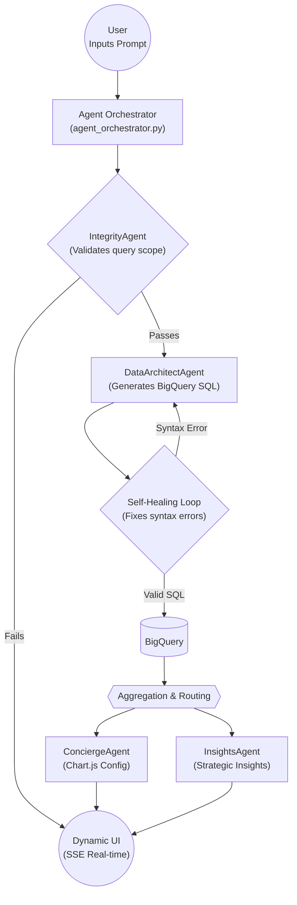

# Full-Funnel Ads Strategic Concierge
### A Deterministic, Multi-Agent System for Enterprise Analytics

A natural language analytics agent built on top of GA4 BigQuery data. Ask business questions in plain English — the system generates SQL, executes it against BigQuery, runs deterministic calculations, and returns a live chart and strategic insight, all streamed in real-time to a web UI.

Built for the **Google Kaggle GenAI Hackathon 2025**.

---

## Problem

Traditional BI dashboards (Looker, Tableau) are rigid. FP&A and marketing analysts spend hours writing SQL, cleaning data, and building charts manually — before any insight work even begins. "Chat-to-Data" tools attempt to solve this but fail in production due to:

1. **Hallucinations** — LLMs invent schema columns that don't exist (e.g., `traffic_medium` instead of `medium`)
2. **Calculation errors** — LLMs performing complex math (ROAS, CVR, bounce rate) in SQL lead to division-by-zero crashes
3. **Operational failures** — No safety mechanism when queries fail; system crashes silently

---

## Solution: 3-Layer Multi-Agent Architecture

```
Directives (SOPs) → Orchestration (Python) → Execution (Deterministic Scripts)
```

| Layer | Role | Files |
|---|---|---|
| **Directives** | Markdown SOPs defining each agent's behavior | `directives/` |
| **Orchestration** | Python orchestrator routing between agents | `execution/agent_orchestrator.py` |
| **Execution** | Deterministic scripts for SQL, math, charting | `execution/calculation_engine.py` etc. |

### Agents

1. **ClarificationAgent** — Maps ambiguous natural language to canonical metrics
2. **IntegrityAgent** — Forensic null-value check on the dataset before any query runs
3. **DataArchitectAgent** — Translates user intent to BigQuery SQL (raw atomic counts only, no derived math)
4. **CalculationAgent** — Deterministic Python math engine (ROAS, CVR, bounce rate, etc.)
5. **ConciergeAgent** — Dynamically selects chart type and generates Chart.js JSON config
6. **InsightsAgent** — Generates plain-English strategic recommendations from the data

### Architecture Diagram



### Key Innovations

- **Self-Healing SQL Loop** — If generated SQL fails BigQuery dry-run, error is fed back to the DataArchitectAgent automatically (up to 3 retries)
- **HITL Safety Gate** — After 3 failures, system surfaces an `EVAL_FAIL` flag requiring human review before proceeding
- **Visual Memory Bank** — `config/visual_memory.json` ensures semantic consistency across chart selections (same query type = same chart)
- **Deterministic Evaluation Harness** — 15 golden tests across all 5 agents, scored via BigQuery dry-run API + regex + LLM-as-a-judge

---

## Tech Stack

- **Backend:** Python, Flask, Server-Sent Events (SSE)
- **LLM:** Google Gemini API
- **Database:** Google BigQuery (GA4 public dataset)
- **Frontend:** Vanilla HTML/CSS/JS, Chart.js
- **Package Manager:** `uv`

---

## Setup Instructions

### Prerequisites

- Python 3.11+
- [`uv`](https://docs.astral.sh/uv/) package manager
- A Google Cloud project with BigQuery API enabled
- A Google Gemini API key ([get one here](https://aistudio.google.com/apikey))
- A Google Cloud service account with BigQuery read access

### 1. Clone the repository

```bash
git clone https://github.com/hozongjin/full-funnel-ads-strategic-concierge.git
cd full-funnel-ads-strategic-concierge
```

### 2. Set up environment variables

```bash
cp .env.example .env
```

Edit `.env` and fill in:
- `GEMINI_API_KEY` — your Gemini API key
- `GOOGLE_APPLICATION_CREDENTIALS` — path to your service account JSON file (save it as `credentials.json` in the root)

### 3. Configure your BigQuery dataset

Edit `config/master_data.yaml` and update the `project_id` and `dataset_id` fields to point to your GA4 BigQuery export.

### 4. Install dependencies and run

```bash
uv run execution/app.py
```

The app will be available at `http://localhost:5000`.

---

## Evaluation

The project includes a full regression test suite covering all 5 agents:

```bash
uv run execution/agents_cli.py eval run --agent all --runs 3
```

**Results (15 tests, 1 run):**

```
[clarification-ambiguous-metric]    Avg: 100.0 | Status: STABLE
[clarification-time-series]         Avg: 100.0 | Status: STABLE
[clarification-missing-data]        Avg: 100.0 | Status: STABLE
[dataarchitect-strict-raw-counts]   Avg: 100.0 | Status: STABLE
[dataarchitect-date-filtering]      Avg: 100.0 | Status: STABLE
[dataarchitect-unnest-items]        Avg: 100.0 | Status: STABLE
[concierge-visual-memory]           Avg: 100.0 | Status: STABLE
[concierge-anti-truncation]         Avg: 100.0 | Status: STABLE
[concierge-multi-series]            Avg: 100.0 | Status: STABLE
[insights-actionable-recommendation] Avg: 95.0 | Status: STABLE
[insights-positive-reinforcement]   Avg: 100.0 | Status: STABLE
[insights-hallucination-avoidance]  Avg: 100.0 | Status: STABLE
[integrity-high-null-rate]          Avg: 100.0 | Status: STABLE
[integrity-clean-data]              Avg: 100.0 | Status: STABLE
[integrity-exception-handling]      Avg: 100.0 | Status: STABLE
```

---

## Project Structure

```
├── execution/              # Core Python scripts (orchestration + agents)
│   ├── agent_orchestrator.py
│   ├── agents_cli.py       # CLI evaluation harness
│   ├── calculation_engine.py
│   ├── evaluation_agent.py
│   ├── evaluation_runner.py
│   ├── app.py              # Flask web server
│   └── templates/          # HTML frontend
├── directives/             # Markdown SOPs for each agent
│   ├── clarification_agent_skill.md
│   ├── data_architect_agent_skill.md
│   ├── calculation_agent_skill.md
│   ├── concierge_agent_skill.md
│   ├── insights_agent_skill.md
│   └── integrity_agent_skill.md
├── config/                 # Runtime config and test data
│   ├── master_data.yaml    # Dataset config, metric definitions
│   ├── golden_tests.json   # Regression test cases
│   ├── ga4_quirk_registry.json
│   └── visual_memory.json  # Chart consistency memory
├── specs/                  # Project documentation
├── ga4_data_dictionary.md  # Metric definitions and formulas
├── kaggle_writeup_draft.md # Hackathon writeup
├── .env.example            # Template for environment variables
└── README.md
```

---

## Security

- API keys and credentials are stored in `.env` and `credentials.json` — both excluded from version control via `.gitignore`
- BigQuery access is read-only (SELECT statements only, enforced via evaluation_agent.py)
- All SQL is validated via BigQuery dry-run API before execution

---

## Course Concepts Demonstrated

| Concept | Implementation |
|---|---|
| **Multi-agent systems** | 5-agent sequential pipeline (Clarification → Integrity → DataArchitect → Calculation → Concierge + Insights) |
| **Antigravity** | Primary AI pair-programming IDE used throughout development |
| **Security features** | Read-only BigQuery SQL, HITL pause gate, no API keys in code |
| **Deployability** | Stateless Flask app, container-ready for Google Cloud Run |
| **Agent skills** | `agents_cli.py` evaluation harness + Markdown directive SOPs |
