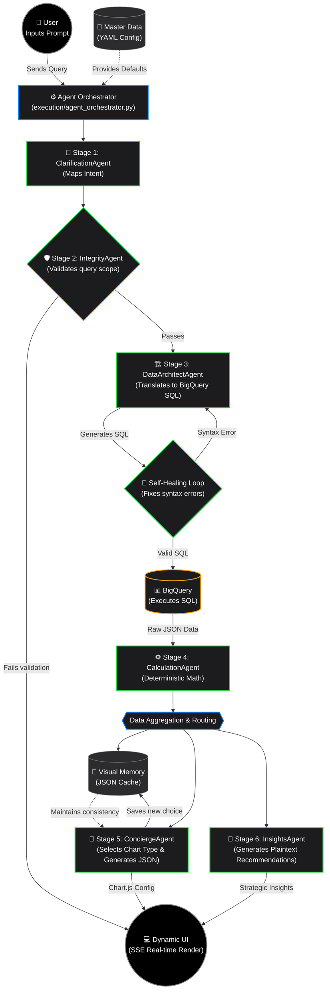

```mermaid
flowchart TD
    %% Styling
    classDef userNode fill:#000000,stroke:#86868b,stroke-width:2px,color:#fff
    classDef orchestratorNode fill:#1c1c1e,stroke:#0A84FF,stroke-width:2px,color:#fff
    classDef agentNode fill:#1c1c1e,stroke:#32d74b,stroke-width:2px,color:#fff
    classDef systemNode fill:#1c1c1e,stroke:#FF9F0A,stroke-width:2px,color:#fff
    classDef dataNode fill:#2c2c2e,stroke:#86868b,stroke-width:1px,color:#fff,shape:cylinder

    %% Nodes
    User(("👤 User\nInputs Prompt")):::userNode
    
    Orchestrator["⚙️ Agent Orchestrator\n(execution/agent_orchestrator.py)"]:::orchestratorNode
    MasterData[("📄 Master Data\n(YAML Config)")]:::dataNode
    
    ClarificationAgent["🧠 Stage 1: ClarificationAgent\n(Maps Intent)"]:::agentNode
    
    IntegrityAgent{"🛡️ Stage 2: IntegrityAgent\n(Validates query scope)"}:::agentNode
    
    DataArchitect["🏗️ Stage 3: DataArchitectAgent\n(Translates to BigQuery SQL)"]:::agentNode
    SelfHeal{"🔄 Self-Healing Loop\n(Fixes syntax errors)"}:::agentNode
    
    BQ[("📊 BigQuery\n(Executes SQL)")]:::systemNode
    
    CalculationAgent["⚙️ Stage 4: CalculationAgent\n(Deterministic Math)"]:::agentNode
    
    ParallelSplit{{"Data Aggregation & Routing"}}:::orchestratorNode
    
    VisualMemory[("🧠 Visual Memory\n(JSON Cache)")]:::dataNode
    ConciergeAgent["🎨 Stage 5: ConciergeAgent\n(Selects Chart Type & Generates JSON)"]:::agentNode
    
    InsightsAgent["🧠 Stage 6: InsightsAgent\n(Generates Plaintext Recommendations)"]:::agentNode
    
    Output(("💻 Dynamic UI\n(SSE Real-time Render)")):::userNode

    %% Edges
    User -->|Sends Query| Orchestrator
    MasterData -.->|Provides Defaults| Orchestrator
    
    Orchestrator --> ClarificationAgent
    ClarificationAgent --> IntegrityAgent
    IntegrityAgent -- "Fails validation" --> Output
    IntegrityAgent -- "Passes" --> DataArchitect
    
    DataArchitect --> |Generates SQL| SelfHeal
    SelfHeal -- "Syntax Error" --> DataArchitect
    SelfHeal -- "Valid SQL" --> BQ
    
    BQ -->|Raw JSON Data| CalculationAgent
    CalculationAgent --> ParallelSplit
    
    ParallelSplit --> VisualMemory
    VisualMemory -.->|Maintains consistency| ConciergeAgent
    ParallelSplit --> ConciergeAgent
    ParallelSplit --> InsightsAgent
    
    ConciergeAgent -->|Saves new choice| VisualMemory
    
    ConciergeAgent --> |Chart.js Config| Output
    InsightsAgent --> |Strategic Insights| Output
```
